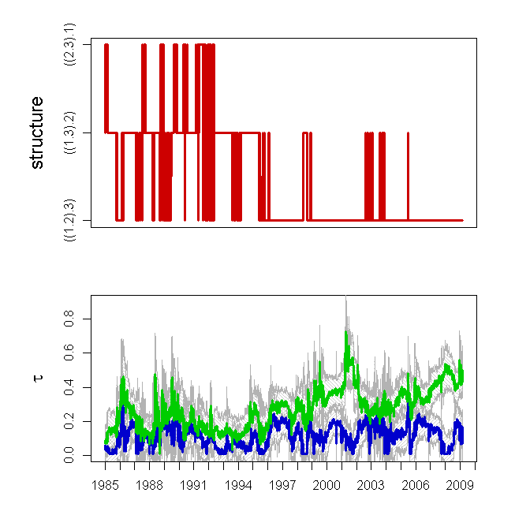
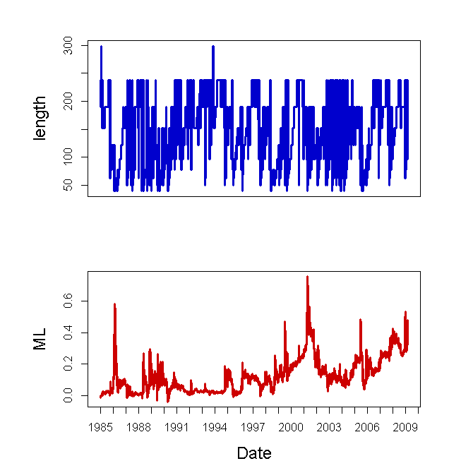
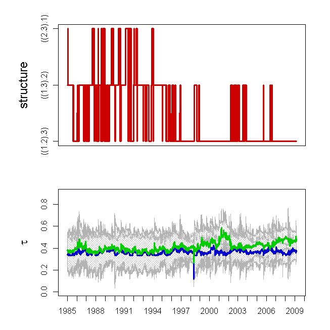
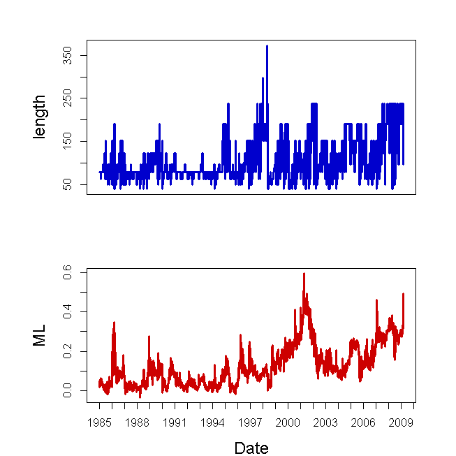

[](http://quantlet.de/index.php?p=info)

## [](http://quantlet.de/) **COPlcpinres** [](http://quantlet.de/d3/ia)


```yaml

Name of Quantlet: COPlcpinres

Published in: Copulae

Description: 'Computes from the results of fitting a Aparch(1,1) model to daily returns, see COPlcpinaparch, when which copula fits the data best. Used are Gumbel and Clayton copula.'

Keywords: clayton, copula, gumbel, HAC, plot

See also: 

Author: Ostap Okhrin, Simon Trimborn

Code Editor: Ramona Steck, Verena Weber

Submitted:  

Datafile: COPclayton, COPgumbel, COPts1dates, COPts1feps

Input: COPhelperfunctions

Output:  
- The Quantlet returns plots which show the structure, the taus on the intervals of homogeneity, the intervals of homogeneity and the ML on these intervals.


Example: 
- 1/2: The example is performed for the indizes Dow Jones (DJ), DAX and NIKKEI in the time span [01.01.1985; 23.12.2010] using the Gumbel copula.
- 3/4: The example is performed for the indizes Dow Jones (DJ), DAX and NIKKEI in the time span [01.01.1985; 23.12.2010] using the Clayton copula.


```








```R
# clear all variables
rm(list = ls(all = TRUE))
graphics.off()

# install and load packages
libraries = c("fGarch", "copula")
lapply(libraries, function(x) if (!(x %in% installed.packages())) {
  install.packages(x)
})
lapply(libraries, library, quietly = TRUE, character.only = TRUE)

GAUSS      = "gauss"
GUMBELHAC  = "gumbelHAC"
GUMBELAC   = "gumbelAC"
CLAYTONHAC = "claytonHAC"
CLAYTONAC  = "claytonAC"

source("COPhelperfunctions2.R")

dates = read.table("COPts1dates")
dates = as.matrix(dates)
feps  = read.table("COPts1feps")

# definitions used for LCP
taus   = c(0.1, 0.3, 0.5, 0.7)
m0LCP  = 40
cLCP   = 1.25
Ak_max = 10
r      = 0.5
rho    = 0.5

# function to convert structure parameter from string into integer value
conv.str = function(st){
  if(st == "((1.2).3)"){
    a = 1
  }
  if(st == "((1.3).2)"){
    a = 2
  }
  if(st == "((2.3).1)"){
    a = 3
  }
  a}

# function to convert structure parameter from integer value into string
get.str = function(st){
  if(st == 1){
    a = "((1.2).3)"
  }
  if(st == 2){
    a = "((1.3).2)"
  }
  if(st == 3){
    a = "((2.3).1)"
  }
  a}

# specify the no. of datapoints that are exempt from estimation
skip = round(m0LCP * cLCP^(Ak_max + 1)) + 1

# LCP for Gumbel
copula.in.use = "gumbel"
Gu            = feps
samplesize    = dim(Gu)[1]
qx            = read.table("COPgumbel")
AGumbel       = make.crit.val(u = Gu, copula_typeL = copula.in.use)

# LCP for Clayton
copula.in.use = "clayton"
Gu            = feps
samplesize    = dim(Gu)[1]
qx            = read.table("COPclayton")
AClayton      = make.crit.val(u = Gu, copula_typeL = copula.in.use)

# derivation sigma_tau
give.sigma.tau = function(A, copula.in.use){
  sigma_tau    = 0
  for(step in 1:dim(A)[1]){
    Lfeps = feps[(skip + step - A[step, 1] + 1):(skip + step), ]
    pair  = if(A[step, 2] == 1){
      c(1, 2)
    } else if(A[step, 2] == 2){
      c(1, 3)
    } else if(A[step, 2] == 3){
      c(2, 3)
    }
    sigma_tau2 = sqrt(abs(16 * var(2 * emp.copula.self.2d(Lfeps[, pair]) -
                                   Lfeps[, pair[1]] - Lfeps[, pair[2]]))) / sqrt(A[step, 1]) * z_alpha
    Lfeps = cbind(cop2d(Lfeps[, pair[1]], Lfeps[, pair[2]], A[step, "theta2"],
                        Ltype = copula.in.use), Lfeps[, setdiff(1:3, pair)])
    sigma_tau1 = sqrt(abs(16 * var(2 * emp.copula.self.2d(Lfeps) - Lfeps[, 1] -
                                   Lfeps[, 2]))) / sqrt(A[step, 1]) * z_alpha
    sigma_tau = rbind(sigma_tau, c(sigma_tau1, sigma_tau2))
  }
    sigma_tau = sigma_tau[-1, ]
}
sigma_tauG = give.sigma.tau(AGumbel,  "gumbel")
sigma_tauC = give.sigma.tau(AClayton, "clayton")

labels = as.numeric(format(as.Date(dates, "%d.%m.%Y"), "%Y"))
where.put = c(1, which(diff(labels) == 1) + 1)

# the plots
plot.COP = function(A, sigma_tau, copula.in.use){
  dev.new()
  layout(matrix(1:2, nrow = 2, byrow = T))
  
  par(mai = (c(0.0, 0.8, 0.1, 0.1) + 0.4))    
  plot(c(0, 0), c(0, 0), xlim = c(0, length(A[, 1])), ylim = c(1, 3), xlab = "",
       ylab = "structure", axes = F, frame = T, cex.lab = 1.5, cex.axis = 1.2)
  lines(A[, 2], type = "l", lwd = 3, col = "red3")
  axis(2, at = 1:3, labels = c(get.str(1), get.str(2), get.str(3)))
  
  par(mai = (c(0.3, 0.8, 0.1, 0.1) + 0.4))    
  plot(theta2tau(A[, 3], copula.in.use), ylim = c(0, 0.9), type = "l",
       lwd = 3, col = "blue3", lty = "solid", axes = F, frame = T,
       xlab = "", ylab = expression(tau), cex.lab = 1.5, cex.axis = 1.2)
  
  polygon(c(1:length(A[, 4]), length(A[, 4]):1), 
          c(theta2tau(A[, 3],copula.in.use) - sigma_tau[, 2], 
            rev(theta2tau(A[, 3], copula.in.use) +sigma_tau[, 2])), 
          col = "grey80", border = "grey70", density = 30, angle = 45)
  polygon(c(1:length(A[, 4]), length(A[, 4]):1), 
          c(theta2tau(A[, 4],copula.in.use) - sigma_tau[, 1], 
            rev(theta2tau(A[, 4], copula.in.use) + sigma_tau[, 1])), 
          col = "grey80", border = "grey70", density = 30, angle = -45)
  
  lines(theta2tau(A[, 3], copula.in.use), lwd = 3, col = "blue3",  lty = "solid")
  lines(theta2tau(A[, 4], copula.in.use), lwd = 3, col = "green3", lty = "solid")
  
  axis(2)
  axis(1, at = where.put, labels = labels[where.put])
  
  dev.new()
  layout(matrix(1:2, nrow = 2, byrow = T))
  par(mai = (c(0.0, 0.8, 0.1, 0.1) + 0.5))    
  plot(A[, 1], type = "l", lwd = 3, col = "blue3", lty = "solid", axes = F,
       frame = T, xlab = "Date", ylab = "length", cex.lab = 1.5, cex.axis = 1.2)
  axis(2)        
  
  par(mai = (c(0.3, 0.8, 0.1, 0.1) + 0.5))    
  plot(A[, 5], type = "l", lwd = 3, col = "red3", lty = "solid", axes = F,
       frame = T, xlab = "Date", ylab = "ML", cex.lab = 1.5, cex.axis = 1.2)
  axis(2)
  axis(1, at = where.put, labels = labels[where.put])  
}

plot.COP(AGumbel,  sigma_tauG, "gumbel")
plot.COP(AClayton, sigma_tauC, "clayton")
```
